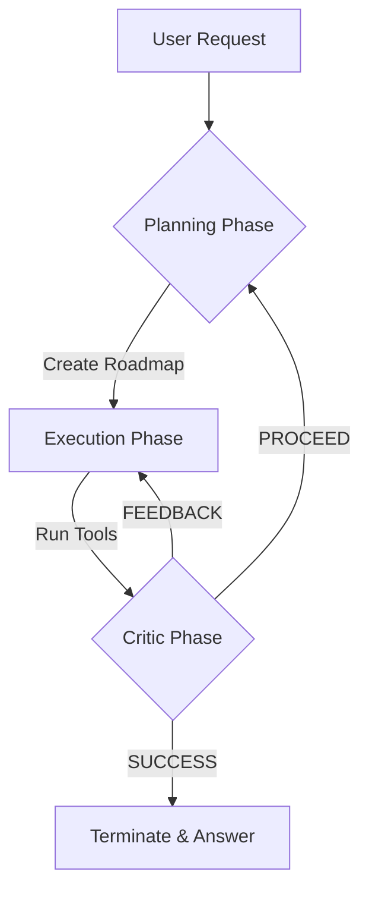

# 🐉 Manus-Củ-Sen ULTIMATE (Core Edition)

> **The Supreme Autonomous AI Agent Engine: Plan, Execute, Critic.**

**Manus-Củ-Sen ULTIMATE** is not just an AI wrapper; it is a full-scale agentic brain designed for high-stakes automation. This project provides the most stable, cost-efficient, and professional-grade implementation of the "Plan-First" architecture.

---

## 📖 Table of Contents
1. [Project Vision](#-project-vision)
2. [Internal Architecture](#-internal-architecture)
3. [Core Robustness Features](#-core-robustness-features)
4. [Master Tool Suite](#-master-tool-suite)
5. [Advanced Configuration](#-advanced-configuration)
6. [Developer's Guide](#-developers-guide)
7. [Troubleshooting & FAQ](#-troubleshooting--faq)

---

## 👁️ Project Vision
The goal of **Manus-Củ-Sen** is to bridge the gap between "chatbots" and "autonomous agents." While most agents fail due to token limits, hallucinatory paths, or system errors, this engine is **hardened** to survive in real-world environments.

---

## 🏗️ Internal Architecture

The engine operates on a three-phase "Manus Cycle":



### Key Modules:
- **`agent_core.py`**: The Orchestrator. Manages the loop and LLM interactions.
- **`schema.py`**: The Guardian. Validates data and sanitizes every single byte sent to the API.
- **`base_tool.py`**: The Blueprint. Ensures every new capability follows a strict standard.
- **`bug_hunter.py`**: The Simulacrum. Allows testing the entire engine without spending a single cent on API costs.

---

## 🛡️ Core Robustness Features

### 1. 🧼 Absolute Token Sanitization (Phase 9/10)
Most modern LLMs occasionally leak internal control tokens (e.g., `<|end_header_id|>`). Strict API gateways (LiteLLM, OpenRouter) will crash with a **400 Bad Request** when these occur. 
- **The Engine Solution**: Every incoming and outgoing message is passed through a regex-based sanitization layer that strips all known control tokens from Llama, ChatML, and GPT families.

### 2. ✂️ Surgical Truncation (Phase 8)
When a search result or a webpage contains 500k characters, most agents die.
- **Our Solution**: We keep the **Top 4,000** and **Bottom 4,000** characters. 
- **Why?** Important headers/titles are at the top; error messages and summaries are at the bottom. The middle is usually redundant noise.

### 3. ⌨️ Auto-Quoting Terminal (Phase 8)
Windows users often have paths like `D:\My Project\File.txt`. A standard agent might run `dir D:\My Project\File.txt`, which crashes.
- **Our Solution**: The Terminal tool detects unquoted paths with spaces and automatically wraps them in `"` before execution.

---

## 🛠️ Master Tool Suite

### 🌐 `browser` (The Vision Specialist)
Utilizes Playwright and a specialized Vision model to interact with HTML just like a human.
- **Special Action: `step`**: Instead of finding CSS selectors, the agent analyzes a screenshot and "decides" where to click.
- **Parameters**: `action` (go_to_url, step, extract, click, type), `url`, `text`.

### 💻 `terminal` (System Integration)
Executes native shell commands.
- **MANDATORY**: Always use for verifying file existence before reading.
- **Protocol**: Operates directly in your system environment (Python/Pip).

### 🔍 `search_tool` (Real-time Intel)
Powered by Tavily for deep, unfiltered web searching.
- **Failover**: If results are vague, the **Critic** automatically triggers the `browser` for deeper research.

---

## ⚙️ Advanced Configuration

All parameters are managed via `config.toml`:

```toml
[primary]
model_name = "gpt-4o"
base_url = "https://api.openai.com/v1"

[[backups]]
name = "Gemini-Pro"
model_name = "gemini-1.5-pro"
supports_tools = true
```

### 💰 Cost Optimization
- **Critic Skipping**: Deterministic tools (Planning, Terminate) skip the expensive reflection phase.
- **Compressed Media**: Screenshots for the browser tool are captured in JPEG 60% quality to minimize token usage for Vision models.

---

## 👨‍💻 Developer's Guide

### Adding a New Tool
1. Create a new file in `tools/`.
2. Inherit from `BaseTool`.
3. Define `parameters` as a JSON Schema.
4. Implement `async def execute()`.
5. Register it in `main.py`.

```python
class MyTool(BaseTool):
    name: str = "my_tool"
    async def execute(self, arg1: str):
        return f"Done: {arg1}"
```

---

## ❓ Troubleshooting & FAQ

**Q: I get a BadRequestError (400) from my provider.**
A: This usually means the context is too large or contains illegal tokens. Check the logs (`loguru`) to see which message triggered it. Our Phase 10 hardening minimizes this to nearly zero.

**Q: The agent stops before finishing the job.**
A: Ensure your plan is structured. The new **Phase 10 Protocol** forces the agent to follow through until the `terminate` call.

**Q: Where are the libraries installed?**
A: Since we removed the UV-forcing, they are installed directly into your active system Python environment.

---

*"Manus-Củ-Sen: Built for stability. Designed for autonomy."*
